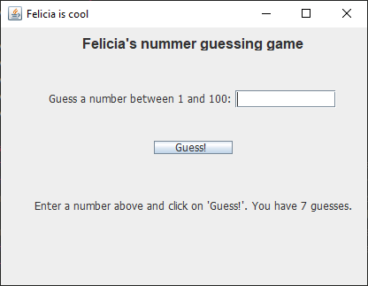
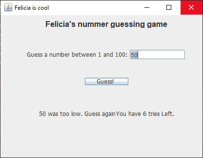
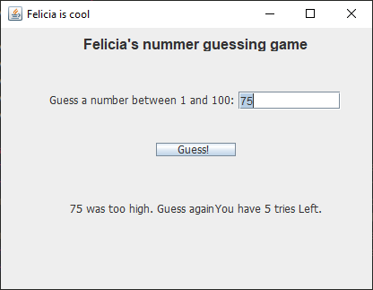
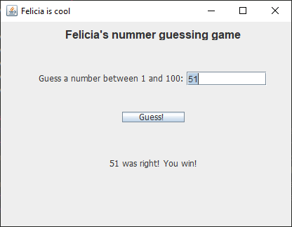
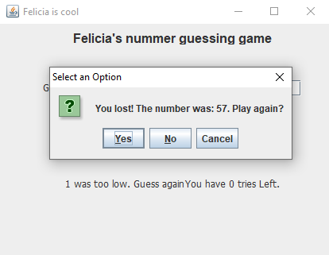

# Short Description:
This is a little number guessing game. It generates a random number between 1 and 100. The user can guess 7 times for the right answer. The robot will give hints each time whether the number is actually higher or lower than the guessed number. After 7 failed attempts the user will lose. 

# Getting Started as a developer:
git clone or pull the project.
```sh 
git clone
```

# Screenshots:





